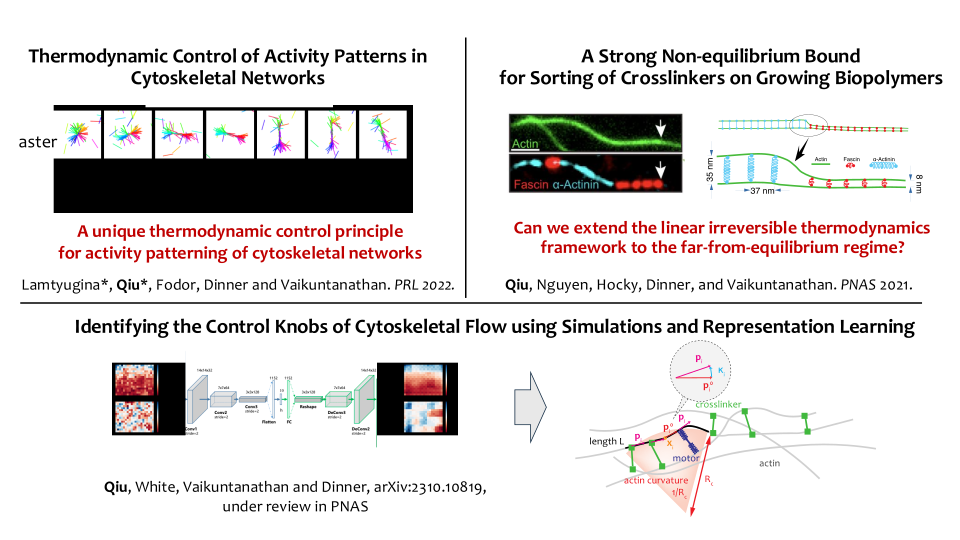
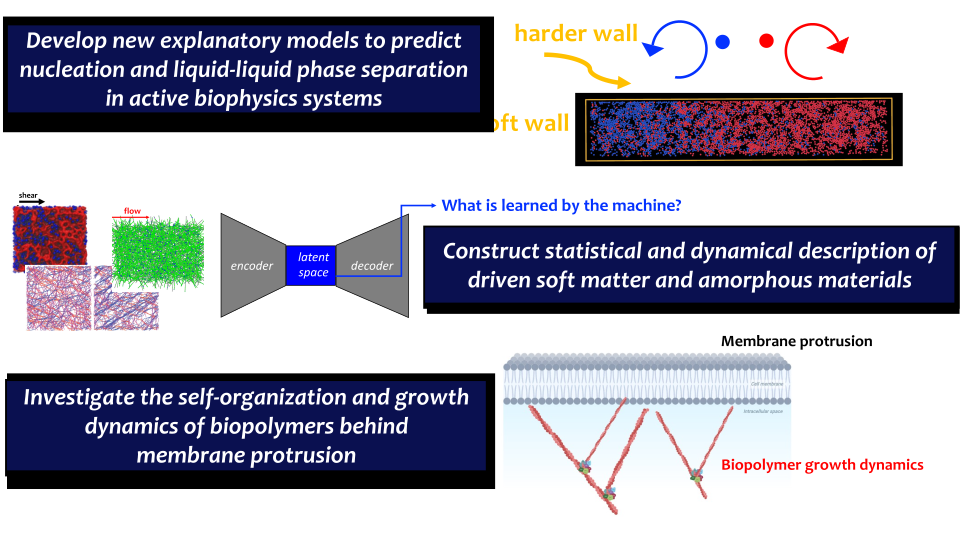

<!-- Research Group Description -->

  

    We investigate non-equilibrium emergent behaviors in <b>soft matter</b> and <b>biophysics</b> with <b>computer simulations</b>, <b>machine learning techniques</b>, and <b>theory</b>.
  

  

    We aim to formulate theoretical frameworks that unveil the interplay of activity, force generation, and emergent architectures.
  

<!-- Research Topics Section -->

  
    • Self-organization in Cytoskeletal Networks • Biological Ice Nucleation   
    • Nucleation in Active Biophysics Systems • Driven Soft Matter and Amorphous Materials  
    • Statistical Mechanics • Non-Equilibrium Thermodynamics • Machine Learning   
    • Agent-based Simulations • Coarse-Grained Models • Molecular Dynamics • Kinetic Monte Carlo
  

<!-- Slideshow Container -->

    <!-- Slideshow Content Wrapper -->
    

        <!-- Manual Navigation Buttons (Left) -->
        <button class="prev" onclick="changeSlide(-1)" style="background-color: rgba(0,0,0,0.5); color: white; border: none; padding: 10px 15px; cursor: pointer; font-size: 25px; height: 40px; position: absolute; left: -5%; top: 50%; transform: translateY(-50%); z-index: 2;">❮</button>

        <!-- Images for the slideshow -->
        

            
            
               
        

        <!-- Manual Navigation Buttons (Right) -->
        <button class="next" onclick="changeSlide(1)" style="background-color: rgba(0,0,0,0.5); color: white; border: none; padding: 10px 15px; cursor: pointer; font-size: 25px; height: 40px; position: absolute; right: -5%; top: 50%; transform: translateY(-50%); z-index: 2;">❯</button>
    

<!-- JavaScript for Slideshow -->

